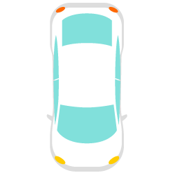

🏎️ Pygame Car Racer
A fun, arcade-style 2D racing game built with Python and Pygame.

Features:
* Smooth Controls: Maneuver your car through traffic using the keyboard.

* Dynamic Difficulty: The game gets faster and more challenging as your score increases!

* Collision Detection: Realistic hit-boxes to keep the gameplay tight and exciting.

* Tech Stack: Language: Python

* Library: Pygame (for sprites, movement, and game loop)

* How to Run: Install Pygame: pip install pygame

* Run the script: python car_game.py

